# Overview:

This program was created for the final project for MAT-239 at Southern New Hampshire University.
This program simulates the outcome of the bridge game from "Squid Game" with varying parameters.
This program provides a solution for how many people should make it across a given bridge.

## What is a bridge?:

In the popular TV show "Squid Game" the contestants must cross a glass bridge made of multiple segments.
The player must choose between 2 glass panes.
One can support the weight of the player, while the other pane will cause the player to fall through.

For this program, a bridge is a nested list containing a randomized assortment of 1's and 0's.
The program will run through each nested list and will perform various actions depending on the values it selects.

An example bridge with 5 segments that have 2 panes and 1 is unsafe pane might look like this:

- [[1, 0], [0, 1], [0, 1], [1,0], [0,1]]

### Game vs Simulation:

The program can achieve two goals and both will be mentioned throughout this document.
The game refers to the ability for the user to choose which tiles are selected and play through a given bridge. At the end the user is presented with text that says "you win!" or "you lose!" along with various statistics about the game.

The simulation refers to using a function to randomly guess panes on a bridge or multiple bridges.
This is used to find meaningful data by generating an average number of players surviving a given bridge segment.

### Using the code as a function:

This code has the ability to have several of the functions used for generating meaningful data.
Towards the bottom of this README, the code will be used as a function to generate meaningful data.

This will be expanded soon...

## Command Line Interface Documentation:

### main.py Overview:

main.py is the CLI of the application. There are 3 functions within main.py.

- programLoop()
- menuSelectionChecker()
- simulationOutput()

programLoop() prints the menu options and waits for an input. If the input is "1" or "2", it will allow the user to enter in game or simulation parameters.
If the user enters "5" to "8" it will run the game or simulation with parameters from the final project.
If a player enters a 9 the program will exit with code 0. This loop will not exit until option 9 is selected.

menuSelectionChecker() is used to determine that the input from the user is valid and wont cause any issues. It is not a complete foolproof system, but ensures some quality of life for using the program.

simulationOutput() provides a human-readable output of simulations from gameResults.averageSuccessRate().

### gameRenderer.py Overview:
This function is the CLI graphical output for the game board. It contains 3 functions to create a comprehensive experience.

- bridgeObfuscator()
- bridgeGUI()
- endGameScreen()

bridgeObfuscator() creates a duplicate of the bridge that has all the 1's and 0's hidden.
It returns the input value of the user's next move.
This is the bridge that the user sees.
This duplicated bridge will have its elements replaced with "C" and "X" as the game progresses.
More information about how this bridge is manipulated is available in gamePlayer overview.

bridgeGUI() displays the game board for the user to use. It contains useful information including:

- Key: █ = unknown tile, X = incorrect guess, C = correct guess.
- Players remaining.
- Chances of the current player surviving.
- The calculated average survival rate for the specified bridge.
- The game board.

endGameScreen() outputs a win or lose screen with game statistics. It contains useful information including:

- A message stating if the player won or lost.
- The specified game parameters.
- The calculated average survival rate for the specified bridge.
- The survivors for this game.

## Function Documentation:

### bridgeGenerator.py Overview:
This is the "core" of the program. It generates a random bridge as a nested list (2-D array).

An example bridge with 3 segments, 2 panes, and 1 unsafe pane looks like this:

- [[0, 1], [1, 0], [1, 0]]

The parameters for the bridge are s, k, and c.

- s = The total length of the bridge in segments.
- k = The number of panes.
- c = The number of unsafe panes.

The function begins by creating an empty list called bridgeRow. A for loop runs for the length of the number of segments.
Inside that loop is another for loop that runs for the length of the number of panes.
This loop creates a list called bridgeColumn of all 0's for the length of the number of panes.
This loop has a while loop inside that will run until the number of unsafe panes is reached.
The while loop generates a random number from 0 to the number of unsafe panes.
If the random number corresponds to a 0 in bridgeColumn, it will be replaced with a 1.

Once the bridgeColumn has the correct number of unsafe panes, it will append itself to bridgeRow.
Once bridgeRow reaches the correct number of segments, the function will return the randomized bridge.

### gamePlayer.py Overview:

These functions allow the game to be played by the user. It contains two functions.

- guessChecker()
- playGame()

guessChecker() is a simple checker to make sure the player enters a value that is correct.
It is not comprehensive of all incorrect inputs.
However, it makes sure that the user does not accidentally input a number out of the range of the segment, or an input of "".
If the user does enter an incorrect input, they are prompted to enter a new number.
The program returns the int of a valid guess.

playGame() takes the input from main.programLoop().
It takes the input of players, segments, tiles, and unsafe tiles.
It creates a copy of the value of players. Next it generates a bridge from bridgeGenerator using the parameters.
Next it creates an obfuscated copy of the bridge from gameRenderer.bridgeObfuscator().
Next it specifies that the current segment starts at 0 so that the game starts at the first segment.

A while loop runs through the game until the current segment value reaches the last segment in the bridge.
Inside this loop, the obfuscated bridge, players, and average survival rate for this bridge are all sent to gameRenderer.bridgeGUI.
After the user makes a guess, the guess is checked for errors using guessChecker.

The loop checks to see if the guess was correct or not. If the user guessed an element in the list marked 1, the number of players will be decreased.
The element in the obfuscated bridge will also be marked X.
If the number of players reaches 0 then it will run gameRenderer.endGameScreen with the "you lose" message.
If the user guessed an element in the list marked 0, the current segment count is advanced by 1.
The element in the obfuscated bridge will also be marked C.
Once the current segment value is equal to the length of the bridge, bridgeRender.endGameScreen will be run with the "you win" message.

### gameResults.py Overview

This file contains one function named averageSuccessRate.
It returns the average number of survivors that reach the end of the bridge.

averageSuccessRate() takes the input of simulations, players, segments, tiles, and unsafe tiles.
It creates an array called gameResults that will store all the simulated game outputs.
It also defines an integer to be the sum of the game results.
A for loop will play through all the simulations using the parameters and append them to gameResults.
The function will then add all the results together.
It will return the average number of results rounded to two decimal places

### gameSimulator.py Overview

This file contains functions that simulate the game one time. It contains two functions.

- playingBoard()
- simulateGame()

playingBoard() simulates playing through a bridge. It will return the number of players that survive the bridge.
It first defines the remaining players as the number of players specified.
A while loop runs until currentSegment is equal to the length of the bridge.
Unlike the gamePlayer, which makes two separate bridges (one for display, and one as the original bridge),
this program will modify the original bridge. It does so to process which tiles have been guessed and which have not.
Since the bridge will never be seen, there is no reason not to.

First, it gets a guess from pawnGuess.
Next, If the guessed pane is equal to 1, it will subtract 1 from the remaining players. It will also replace the pane value with "X".
If the remaining players are equal to 0, the game will end and the function will return 0.
If the guessed pane is equal to 0, the current segment is advanced. It will also replace the pane value with "C".
If that was the last segment, then the game will return the number of players.

simulateGame() Generates a random bridge and then plays through the game. It saves the results and returns them.

### oddsOfSurvival.py Overview

This file contains a single function used to calculate the odds of survival for one player.
It takes the remaining number of segments, the segment length, how many unsafe panes are in the segment,
and the number of guessed panes in a segment.
It calculates the number of panes minus the number of dangerous panes, then divides that number by the number of panes to get a fraction.
For example, if there are two panes and 1 is an unsafe tile, the answer will be 0.5.

It then calculates the rest of the values for each decreasing segment amount until the segment amount is 0.

It takes these numbers and stores them in a list.
The product of that list is then multiplied by 100 to return a percentage.

### pawnGuess.py Overview

pawnGuess makes a random guess given a segment from a bridge. It contains two functions:

- pawnGuess()
- guessReconstructor()

pawnGuess() creates two empty strings called currentWithoutInt and currentWithoutStr.
It is given the current segment called current.

currentWithoutInt is populated with all 0's for the length of the function.
It then has its 0's replaced with X's that are in the list 'current'.
For example:

- if current = [1, 0, X, 0, X, 1, 0], then currentWithoutInt will equal [0, 0, X, 0, X, 0, 0]

currentWithoutStr has all the int values from current applied to it.
For example:

- if current = [1, 0, X, 0, X, 1, 0] then currentWithoutStr will equal [1, 0, 0, 1, 0]

It will then make a random selection called randomListSelection from currentWithoutInt.
With that value, it will replace the original value in currentWithoutInt. 
It will then take these two lists and run them through guessReconstructor().
It will then return the value that guessReconstructor gave it.

guessReconstructor() takes the two lists. It runs them through a loop for the length of currentWithoutInt.
Every element that is not "X" in currentWithoutInt will be changed to the value from currentWithoutInt.
Once the value of G is found, it will return that value.

## Observations and Data:

### Introduction:

Meaningful data can be gathered from the functions in this program.
Most notably, gameResults.averageSuccessRate() and oddsOfSurvival.oddsOfTheCurrentPlayerSurviving.

The observations folder contains all of the methods used to generate the data and attempts to generalize the bridge problem.
All of the functions and their calculations can be found in ./observations/observations.py.

### Initial Observations:

Bridges conceptually are a function to reduce the number of players in a fairly consistent way.
A bridge has an input of the bridge parameters and players and outputs players that is either smaller or equal to the input.
For gameshows, or TV shows about gameshows, they are an easy way to scale down player counts by an expected range of numbers.
Assuming that everyone follows the game rules.

Due to the rules of the game, it is worth noting that it is possible to make it guaranteed to have survivors.
This is done by making the number of unsafe panes in total smaller than the number of players.

### Baseline:

All of the data and graphs are based on the parameters for primary requirements question 1.
That is, 18 segments, 2 panes, 1 unsafe pane, and 20 players.
All simulations are ran 100,000 times for accuracy per incremental change.
Meaning the game is simulated in total 1,000,000 times if there are 10 x increments for a question.

### Observation 1: What Happens if the Number of Segments Increases?

Starting with the baseline, the number of segments will increase from 18 to 28 using a loop.
This function is called increasingNumberOfSegments().
This is the output:

x is the number of segments, and y is the number of survivors:
- x: 18 y: 10.99
- x: 19 y: 10.5
- x: 20 y: 10
- x: 21 y: 9.5
- x: 22 y: 8.99
- x: 23 y: 8.49
- x: 24 y: 8.0
- x: 25 y: 7.51
- x: 26 y: 7.0
- x: 27 y: 6.5

If the numbers are rounded to the first decimal place,
it is clear that with every segment, there are 1/2 fewer survivors on average that make it.
This result makes this a linear equation.

This is a graphical representation from Desmos.com:

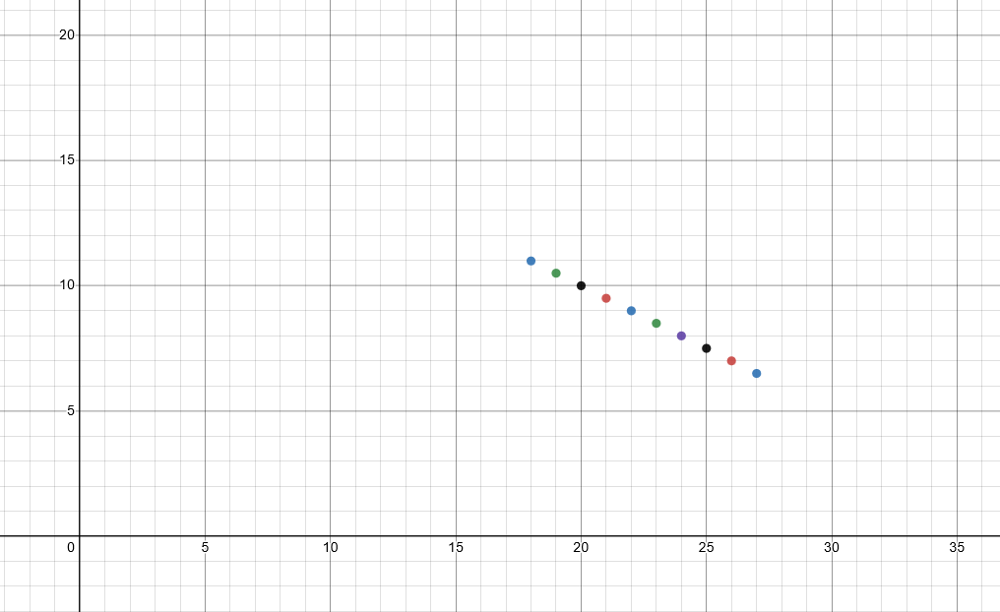

It is easy to place a line through this, and this is a classic example of the y = mx+b formula.

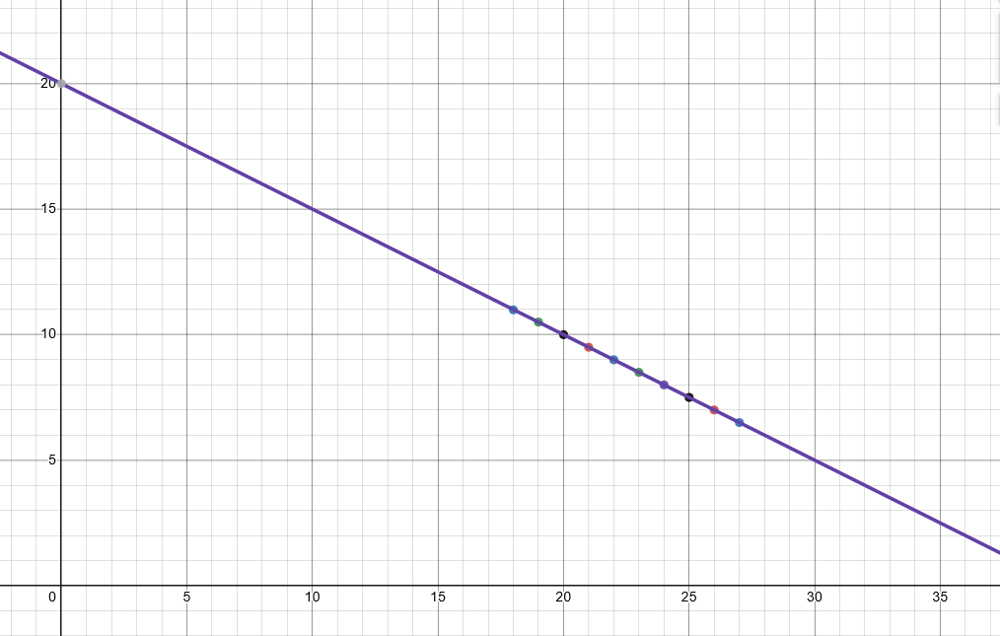

This is the formula for this operation:

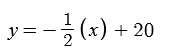

After 40 segments, we are almost guaranteed no survivors.

### Observation 2: What Happens if the Number of Panes Increases, but Not the Number of Unsafe Panes?

Starting with the baseline, what happens if the amount of panes increases, but the number of unsafe panes does not?
This refers to the width of the bridge increasing.
The chances of surviving each segment increases greatly from 1/2 to 2/3, and so on. This is the output:

x is the number of panes, and y is the number of survivors: 

- x: 2 y: 11.0
- x: 3 y: 13.99
- x: 4 y: 15.49
- x: 5 y: 16.41
- x: 6 y: 16.99
- x: 7 y: 17.42
- x: 8 y: 17.75
- x: 9 y: 18.01
- x: 10 y: 18.19
- x: 11 y: 18.37
- x: 12 y: 18.51

The graphical representation looks like this:

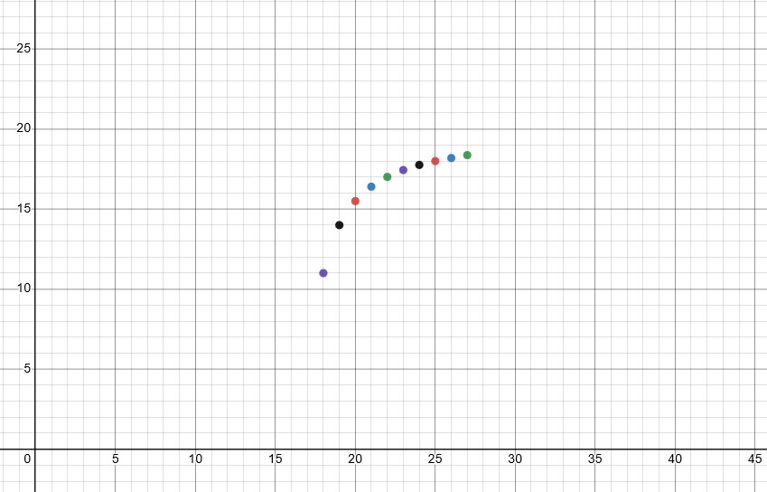

This follows a similar curve to this forumula:

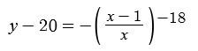

This function is not translated, but it could be moved to fit the curve demonstrated in this question.

### Observation 3: What Happens if the Number of Panes Increase and the Number of Unsafe Panes?

Starting with the baseline, what happens if the number of panes increases with the number of unsafe panes?

This is similar to the extension requirement question 2, where there are now three panes per segment and two of which are unsafe.
This is the output:

x is the increase of panes and segments, and y is the number of survivors:

- x: 18 y: 10.99
- x: 19 y: 2.59
- x: 20 y: 0.14
- x: 21 y: 0.01
- x: 22 y: 0.0
- x: 23 y: 0.0
- x: 24 y: 0.0
- x: 25 y: 0.0
- x: 26 y: 0.0
- x: 27 y: 0.0

The decrease is exponential. That is exactly what expansion requirement 2 set out to demonstrate.

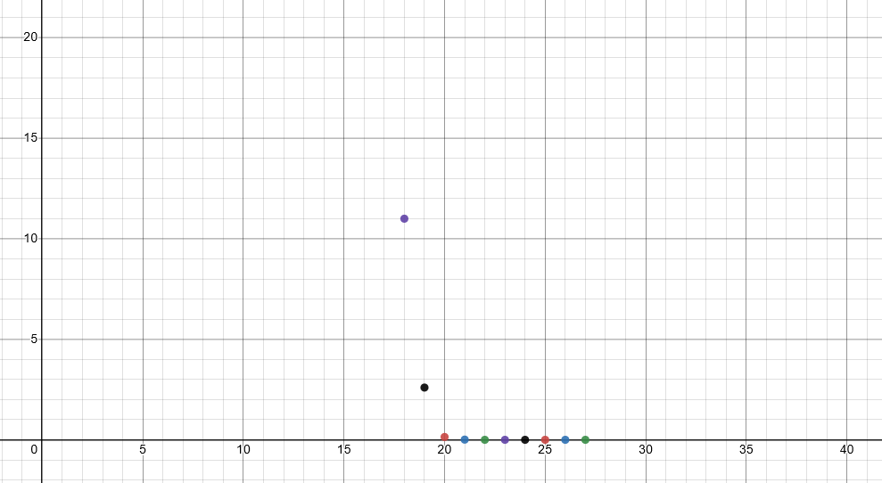

### Question 4: Increasing Number of Players

It is already true that it is impossible to have 0 survivors from the first bridge.
However, there is a point where the number of players surviving become linear by adding more players.

This is the output of increasing the number of players:

- x: 1 y: 0.0
- x: 2 y: 0.0
- x: 3 y: 0.0
- x: 4 y: 0.0
- x: 5 y: 0.02
- x: 6 y: 0.07
- x: 7 y: 0.19
- x: 8 y: 0.43
- x: 9 y: 0.84
- x: 10 y: 1.42
- x: 11 y: 2.19
- x: 12 y: 3.07
- x: 13 y: 4.03
- x: 14 y: 5.01
- x: 15 y: 6.01
- x: 16 y: 6.99
- x: 17 y: 7.99
- x: 18 y: 9.0
- x: 19 y: 10.0

This is a graphical representation of the function:

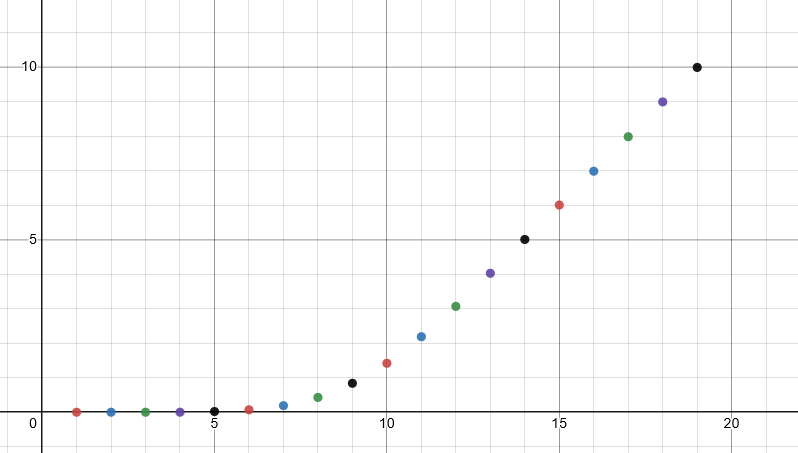

The function starts to linearly rise around y 9.
This could be useful for calculating a difficulty for a given bridge or making the outcome less predictable.
This could mean that around 9 players, the game is subjectively most suspenseful.

We can find a line that intersects the linear portion of this graph.

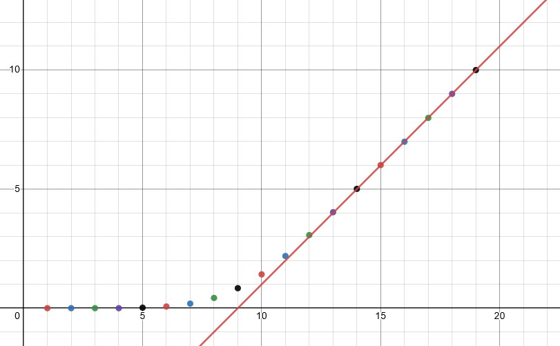

This is the formula for this line graph:

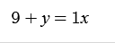

Using this formula, 9 is the point where the graph reaches linearity.
It is also worth noting that for every increase past that, it increases by 1 each time.

### Observation 5: Increasing Number of Players and Segments 

This function is achieved by increasing both the number of players and segments by 1.
The number of players starts at 20, and the number of segments starts at 18.
The next iteration would be 21 players and 19 segments.

x is the increase of the number of segments, and y is the number of survivors:

Note: The number of player increases follows x but is not x itself

- x: 20 y: 10.99
- x: 21 y: 11.5
- x: 22 y: 12.0
- x: 23 y: 12.48
- x: 24 y: 13.0
- x: 25 y: 13.5
- x: 26 y: 14.0
- x: 27 y: 14.5
- x: 28 y: 15.01
- x: 29 y: 15.5

This is the graphical representation for the function:

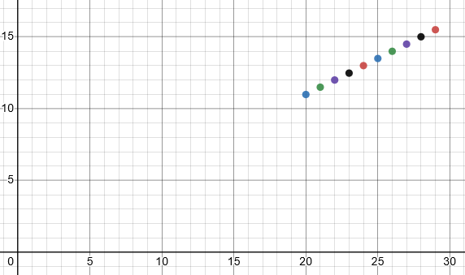

This is inverse to just increasing the number of segments.
Instead of a decrease of 1/2, there is now an increase of 1/2 for survival rate.

Here is the graph with a line with a rise of 1/2:

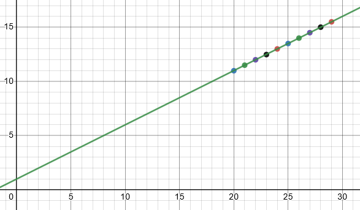

Here is the formula used to intersect the points:

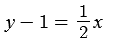

### Observation 6: Calculating the Chances of the First Player Winning

Using the formula in oddsOfSurvival.py. The odds of the current player winning can be observed.
The function's documentation can be found in oddsOfSurvival.py Overview.

Observing from the first tile to the last tile, we can see the following:

- 18: 0.00038%
- 17: 0.00076%
- 16: 0.00152%
- 15: 0.00305%
- 14: 0.06103%
- 13: 0.01220%
- 12: 0.02441%
- 11: 0.04882%
- 10: 0.09765%
- 09: 0.19531%
- 08: 0.39062%
- 07: 0.78125%
- 06: 1.5625%
- 05: 3.125%
- 04: 6.25%
- 03: 12.5%
- 02: 25%
- 01: 50%

Given these numbers, it is possible to graph them using a generalized formula based on the formula from oddsOfSurvival.py.

This is a generalized formula that ignores decreasing the number of tiles left to guess.

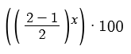

- The fraction indicates the number of panes minus the number of unsafe panes.
- x indicates the amount of segments remaining.

This is the graphical output for these values:

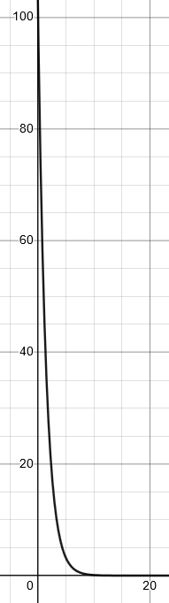

This is the same graph but with x representing the number of panes and y representing the number of players.

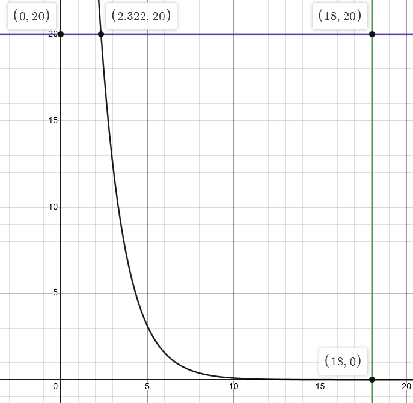

That intersection between the number of players correlates with increasing the total number of players for this specific grid.
It is also around when the chances of one player actually winning start to become realistic.

Using these and the concept of permutation, it may be possible to solve a bridge without having to simulate it.
It may also be possible to do this project entirely without code.
Using a computer, This could be graphed or have the values entered into a table.

A interesting takeaway is that it is still more likely for someone to survive this bridge from start to finish than it is for someone to win the lottery.
Someone is also much more likely to suffocate in bed accidentally.

## References:

### Special thank you to Dr. Gilbert and his discrete mathematics course.

Much of the material learned here was in thanks to his course and his amazing book.

His discrete mathematics book can be found [here.](https://agmath.github.io/DiscreteMathForComputing/output/html/dm4c.html)

### Works Referenced During the Creation of This Project and Observation:

[CNN - 5 Things More Likely to Happen Than You Winning the Lottery](https://www.cnn.com/2018/10/23/us/lottery-winning-odds-trnd/index.html)

[Desmos Graphing Calculator](https://www.desmos.com/calculator)

[Educba - Python Deepcopy](https://www.educba.com/python-deepcopy/)

[Geeks For Geeks - 2D Arrays in Python](https://www.geeksforgeeks.org/python-using-2d-arrays-lists-the-right-way/)

[Geeks For Geeks - Integer Count in Mixed List](https://www.geeksforgeeks.org/python-integer-count-in-mixed-list/)

[Python.org - Random Library](https://docs.python.org/3/library/random.html)

[TextKool - ASCII Generator](https://textkool.com/en/ascii-art-generator?hl=default&vl=default&font=Red%20Phoenix&text=Your%20text%20here%20ssadsad)
